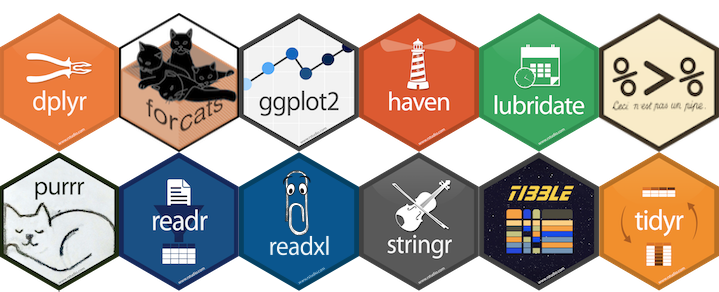

class: top, left

# O que é o R?

> "R é um ambiente de software livre para computação estatística e gráficos" (https://www.r-project.org/). 

<br>
### Algumas Vantagens
1. Open Source

2. Vasta comunidade de usuários

3. Cross Platform Compatible (Unix/Linux, Mac e Windows)

4. Integração com outras linguagens (Python, C, SQL etc. )

```{r, out.width="20%", fig.align='center', echo = FALSE }
knitr::include_graphics("R_logo.png")
#pagedown::chrome_print("Introducao-R.html")
```

---
background-image: url(R_logo.png)
background-position: 90% 10% 
background-size: 20%


class: top, left

# O que é possível fazer com o R?

<br>

1. Análise de dados - Estatística, modelagem, etc.

2. Visualização de dados

3. Relatórios dinâmicos

4. Apresentações

5. Mineração de dados

6. E muito mais ...


---
class: inverse, center, middle

# Primeiros Passos

---

# Instalação do R + Rstudio

A versão mais recente da linguagem R pode ser baixada em https://www.r-project.org/:
<br>
- [Download R for Linux](https://vps.fmvz.usp.br/CRAN/)

- [Download R for MAC](https://vps.fmvz.usp.br/CRAN/)

- [Download R for Windows](https://vps.fmvz.usp.br/CRAN/)
<br>
### RStudio

A plataforma Rstudio foi desenhada para rodar códigos da linguagem R.
Você pode baixar em [RStudio IDE](https://rstudio.com/products/rstudio/download/#download).


---
### Arquivos

O R gera alguns tipos de arquivos que podem ser salvos. As principais deles são:

- **.R** -Usado para salvar códigos criados e rotinas de análises (scripts).

- **.RData** - Usado para salvar os objetos da área de trabalho (workspace).

- **.Rhistory** - Usado para salvar o histórico dos comandos executados (normalmente salvo automaticamente).

- **.Rproj** - Formato exclusivo do RStudio, serve para salvar todas as informações utilizadas anteriormente pelo RStudio de maneira simplificada.

### Área de trabalho e diretório de trabalho

- getwd() # Mostrar o diretório de trabalho atual

- dir()   # Listar os arquivos do diretório

- setwd() # Mudar o diretório de trabalho


---

### Help!

- Pedir ajuda: **help**(nome_da_função) ou **?**(nome_da_função)

```{r}
?mean()

```

### Pacotes no R

**1. Instalar**

- Via CRAN 
```{r echo=TRUE, eval = FALSE, cache=TRUE, warning=FALSE}
install.packages("tidyverse")
```

- Via GitHub

```{r echo=TRUE, cache=TRUE, eval=FALSE, warning=FALSE}
devtools::install_github("tidyverse/purr") 
```

---
**2. Carregar**

- library(nome_do_pacote)

```{r echo=TRUE, cache=TRUE, eval=FALSE, warning=FALSE}
library(tidyverse)
```

- require(nome_do_pacote)

```{r echo=TRUE, cache=TRUE, eval=FALSE, warning=FALSE}
require(tidyverse)
```

### Atalhos 

- CTRL + ENTER: roda a linha selecionada no script.

- ALT + -: (<-) sinal de atribuição.

---
 ### Sintaxe Básica dos Comandos

```{r results='markup'}
2+2 # Adição

3-1 # subtração

4/2 # divisão

5*3 # multiplicação
```

---

 ### Sintaxe Básica dos Comandos

```{r results='markup'}
9 %% 5   # resto da divisão de 9 por 5

7 %/% 4  # parte inteira da divisão de 7  por 4 

4^ 2    # potenciação

sqrt(16) # radiciação


```


- O sinal $>$ indica que o R está pronto para receber um comando.
- O sinal $+$ é o estado de espera, indica que o usuário enviou um comando incompleto.

---

### Atribuição de Objetos no R

Os objetos dentro do R podem ser salvos temporariamente na área de trabalho (workspace). Para atribuir um objeto utilizamos:

O atalho ALT + $-$ que gera o operador $<-$, ou o símbolo de igual $(=)$

- **nome_do_objeto** $<-$ valor
- **nome_do_objeto** $=$ valor

```{r results='markup'}

x <- 15
x

disciplina <- "Aprendizagem Estatística"
disciplina

Saldo <- TRUE
Saldo
```

---

### Tipos de objetos e Estruturas de Dados

- Character: texto

```{r}
nome <- "Ana"
nome  # sempre com aspas
class(nome)
```


- Numeric: números racionais ou inteiros
```{r}
y <- 4.5
y
class(y)

```

---

### Tipos de objetos e Estruturas de Dados

- Logical: TRUE, FALSE ou NA
```{r}
ordem <- TRUE
ordem
class(TRUE)
```

- Complex: números complexos 
```{r}
numero <- 4+5i
numero
class(numero)
```

---

### Tipos de objetos e Estruturas de Dados

- Factor: variavéis categóricas

```{r}
Ordem <- c("Compra", "Venda")
Ordem <- as.factor(Ordem) 
Ordem

```

A função as.factor() transforma a variável Ordem em um fator.

Levels: Refere-se aos rótulos da variável Ordem.

```{r, out.width="20%", fig.align='center', echo = FALSE }
knitr::include_graphics("forcats.png")
```

O pacote [forcats](https://forcats.tidyverse.org/) é ideal para trabalhar com este tipo de variável.

---

```{r, out.width="75%", fig.align='center', echo = FALSE, fig.cap= "<center><b>Fonte: <a href='https://mgimond.github.io/ES218/Week02a.html#data_structures'>Manny Gimond (2020)</a></b></center>" }
knitr::include_graphics("data_structures.png")
```


- **Vetor**: Armazena elementos de mesmo tipo e/ ou classe. Um vetor pode ser criado usando a função c().

- **Matriz**: Matrizes em R podem ser pensadas como vetores indexados usando dois índices em vez de um. São estruturas bidimensionais.

- **Data Frame**: São tabelas de dados com linhas e colunas, como uma tabela do Excel. Pode conter diferentes tipos de dados (numérico, fator, …).
- **Listas**: Uma lista é um conjunto ordenado de componentes armazenados em um vetor 1D.

---

### Tipos de objetos e Estruturas de Dados

```{r}
vetor <- c(1.2,2.5,3.7,4,5)
length(vetor) # retorna o tamanho do vetor
vetor[3] # acessando o elemento da terceira posição do meu vetor

matriz <- matrix(1:12, nrow = 3, ncol = 4, byrow = TRUE)
matriz

dim(matriz) # retorna a dimensão da matriz

```

---
### Tipos de objetos e Estruturas de Dados
```{r}

matriz[1,2]  # acessa o elemento da linha 1 coluna 2
matriz[1,]   # acessa todos os elementos da linha 1
matriz[,2]  # acessa todos os elementos da coluna 2

dados <- data.frame(ano = 2000:2004,
                 prod = c(32, 54, 25, 48, 29))
dados

```

---

### Tipos de objetos e Estruturas de Dados

```{r}
dim(dados) # dimensãoes do data frame
str(dados) # tipos de variáveis no data frame 

dados[,1]
dados[,2]

```


---

### Tipos de objetos e Estruturas de Dados

```{r}
minha_lista <- list() # cria uma lista vazia

ls() # lista todos os objetos 

minha_lista[[1]] <- dados 
minha_lista[[2]] <-matriz
minha_lista[[3]] <-vetor
```
---
### Tipos de objetos e Estruturas de Dados
```{r}
minha_lista

minha_lista[[3]] # acessando o vetor na lista
minha_lista[[3]][5] # acessando a posição 5 do vetor na lista

```
---

### Um pouco mais sobre data frames

- head(): Mostra o cabeçalho do data frame.

- tail(): Mostra as últimas linhas do data frame.

- names(): Apresenta os nomes das variavéis.

- View(): Mostra o dataframe.

### Operadores Relacionais 

- Igual a: ==

- Diferente de: !=

- Maior que: >

- Maior ou igual: >=

- Menor que: <

- Menor ou igual: <=
---

### Operadores Lógicos 

- E: **&** Será verdadeiro se os dois forem TRUE 
```{r}
x <- 10

x>5 & x>7


```

- OU: **|** Será verdadeiro se um dos dois forem TRUE
```{r}
y <- 8
y>7 | y<3
```

- Negação: **!** 
```{r}
z <- 3
(!z>3)

```

---
### Estrutura Condicional: **IF** e **ELSE**

```{r}

situacao <- "Aprovado"
if(situacao=="Aprovado"){
  print("Parabéns!")
}


situacao1 <- "Reprovado"
if(situacao1=="Aprovado"){
  print("Parabéns")
}else{
   print("Tente outra vez!")
}


ordem <- c(0,1,0,1,0,1) # 0-venda 1- pra compra
ordem <- ifelse(ordem==1,"Compra","Venda")
print(ordem)


```


---
### Estrutura de Repetição: **FOR**

```{r}
df <- iris

head(df) # possui 6 linhas e 5 colunas
especies <- as.character(df$Species)
for(i in 1:6){
  print(especies[i])
}

```
---
class: inverse, center, middle

# Manipulação de Dados

---

background-position: 55% 5% 
background-size: 10%

# [Tidyverse](https://www.tidyverse.org/)

>É uma coleção de pacotes R voltados para a ciência de dados. Todos os pacotes compartilham uma mesma filosofia de desenvolvimento, sintaxe e estruturas de dados.

<br>
```{r, out.width="70%", fig.align='center', echo = FALSE }

```

```{r, out.width="15%", fig.align='center', echo = FALSE }
knitr::include_graphics("tidyverse.png")
```
---

background-image: url(ggplot22.png)
background-position: 90% 5% 
background-size: 50%

### Principais pacotes do Tidyverse

- **ggplot2**: Destinado para criação de gráficos.

- **dplyr**:  Manipulação de dados.

- **tidyr**: Reorganiza os dados 

- **readr**: Leitura dos dados 

- **purrr**: Ferramentas para programação funcional, trabalha com funções e vetores. 
- **tibble**: Recriação moderna do data frame.

- **magrittr**: Facilita a escrita e leitura do código 

- **stringr**: Manipulação strings. 

- **forcats**: Manipulação com fatores. 

---
### O Pipe %>%

O objetivo do pipe é ajudá-lo a escrever código de uma maneira que seja mais fácil de ler e entender.


```{r warning=FALSE, message=FALSE}
library(tidyverse)

notas <- c(9.555,10,9.889)

media <- round(mean(notas),2)

media2 <- notas %>% mean() %>% round(2) # com pipe

```

#### Importação de arquivos

- read.table()

Pacote [readr](https://rawgit.com/rstudio/cheatsheets/master/data-import.pdf): funções para ler arquivos texto

- read_csv
- read_csv2

Pacote readxl: função para ler arquivo Excel 

- read_excel
- read_xls


---

### dplyr: Principais verbos

A ideia do pacote **dplyr** é tornar a manipulação de dados explícita.


- **filter()**: seleciona linhas

- **arrange()**: ordena de acordo com uma ou mais colunas

- **select()**: seleciona colunas

- **mutate()**: cria/modifica colunas

- **summarise()**: sumariza/agrega colunas

- **group_by()**: agrupa colunas

---

### filter

```{r results='hold'}

data("starwars")
dados <- starwars

dados %>%  filter(species =="Human" & eye_color=="blue") 

```
---

### arrange 

Ordenar as linhas da base de dados conforme uma ou mais variáveis.

```{r results='hold'}
# Ordenando os personagens pela altura em cm
dados %>% arrange(height) # default ordem crescente
```
---
### filter e arrange

```{r}
dados %>%  filter(eye_color=="yellow") %>% arrange(mass)
#Dud Bolt  
```

---

### select

Seleciona as colunas na base de dados.

```{r results='hold'}

dados %>% select(name,species,homeworld)


```

---

### Funções úteis do select

- **starts_with("h")**: seleciona colunas que começam com "h"
```{r}
dados %>% select(starts_with("h")) %>% names()
```

- **ends_with("or")**: seleciona colunas que terminam com "or"
```{r}
dados %>% select(ends_with("or")) %>% names()
```

- **contains("w")**: seleciona colunas que contêm "w"
```{r}
dados %>% select(contains("w")) %>% names()
```

---


### mutate

Cria ou modifica uma coluna na base de dados.
```{r results='hold'}

# criando uma nova variável altura em metros
dados %>% select(name,height) %>%
                           mutate(heigth_m=height/100)


```

---

### summarise

Resume os valores das colunas em um só valor, de acordo com funções como
média, mediana, min, máx etc.

```{r results='hold'}

dados %>% summarise(mean(mass, na.rm = TRUE))

dados %>% summarise(max(mass, na.rm = TRUE))

dados %>% summarise(min(mass, na.rm = TRUE))
```
---

### group_by

Agrupa as colunas de uma base de dados. 

```{r results='hold'}

dados %>% group_by(species) %>%
             summarise(Total=n()) %>% 
                    arrange(desc(Total)) %>% drop_na()
```

---


### ggplot2

- divide os gráficos em componentes semânticos como escalas e camadas.

```{r fig.align='center', fig.height=5}
ggplot(dados, aes(x = eye_color)) + 
  geom_bar()+
  coord_flip() # inverte os eixos do gráfico
```

---

### ggplot2

```{r fig.align='center', fig.height=5}
dados %>% mutate(eye_color=fct_infreq(eye_color)) %>%# ordenando os fatores 
ggplot(aes(x = eye_color)) + 
  geom_bar()+
  coord_flip()

```

Os levels da variável eye_color estão ordenados.
---

```{r fig.align='center', fig.height=5}
library(viridis)
dados %>% mutate(eye_color=fct_infreq(eye_color)) %>%# ordenando os fatores 
ggplot(aes(x = eye_color, fill=eye_color)) + 
  geom_bar()+
  coord_flip() +
  theme_bw()+
   scale_fill_viridis_d(option = "inferno") 
 
```
---

### ggplot2

```{r  fig.align='center', fig.height=5}
dados %>% mutate(eye_color=fct_infreq(eye_color)) %>%# ordenando os fatores 
ggplot(aes(x = eye_color, fill=eye_color)) + geom_bar()+
  coord_flip() + theme_bw()+ scale_fill_viridis_d(option = "inferno")+
   theme(legend.position ="none")

```
---
### ggplot2 

```{r  fig.align='center', fig.width=9, echo=FALSE}
dados %>% mutate(eye_color=fct_infreq(eye_color)) %>%# ordenando os fatores 
ggplot(aes(x = eye_color, fill=eye_color)) + geom_bar()+ coord_flip() + theme_bw()+ scale_fill_viridis_d(option = "inferno")+ theme(legend.position ="none",  axis.text=element_text(size=18, face="bold", colour="gray24"),  axis.title=element_text(size=18,face="bold")) 

```
---
### Referências

- R-ladies SP-  https://github.com/rladies/meetup-presentations_sao-paulo

- UFPR- http://leg.ufpr.br/~walmes/cursoR/data-vis/slides/02-tibble.pdf

- http://ecologia.ib.usp.br/bie5782/doku.php?id=bie5782:03_apostila:01-intro

- Manny Gimond- https://mgimond.github.io/ES218/Week02a.html#data_structures

- R for Data Science- https://r4ds.had.co.nz/

- Allison Horst - https://github.com/allisonhorst/stats-illustrations

- Xarigan - https://bookdown.org/yihui/rmarkdown/xaringan.html

---
class: inverse, center, middle

# Obrigada!


